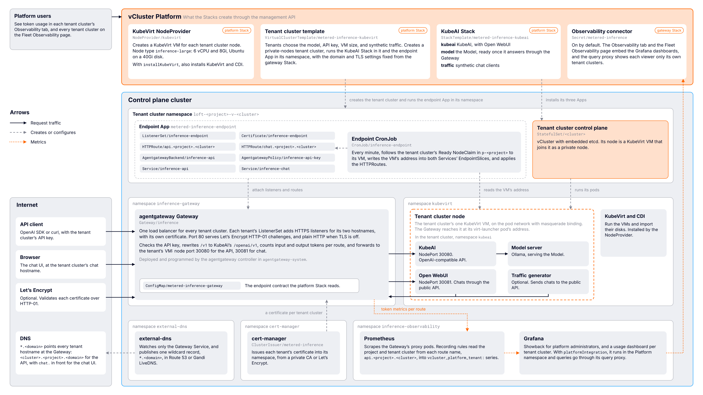
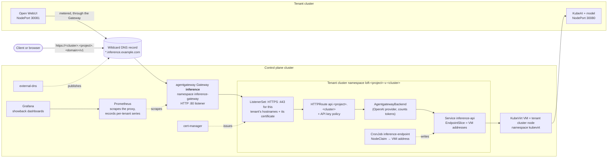

# Metered inference

Three Stacks that deploy a batteries-included metered inference service through vCluster Platform. Each tenant cluster serves an open-weights model on its own OpenAI-compatible endpoint, published with its own hostname and certificate. One shared gateway in the control plane cluster meters the tokens in every request, and Prometheus and Grafana turn that into per-tenant usage and a showback charge.

| Stack | Destination | Install | What it does |
| --- | --- | --- | --- |
| [`metered-inference-gateway`](gateway/stacktemplate.yaml) | Control plane cluster | Once per control plane cluster | Shared agentgateway Gateway, per-tenant TLS through cert-manager, a wildcard DNS record through external-dns, and Prometheus and Grafana showback. Optionally makes that Prometheus and Grafana the Platform's observability backend, so tenants see their own usage. Publishes its endpoint settings in a contract ConfigMap. |
| [`metered-inference-platform`](platform/stacktemplate.yaml) | Control plane cluster | Once per control plane cluster, after the gateway Stack | Configures vCluster Platform from the gateway's contract: the KubeVirt NodeProvider for tenant cluster VMs (which can install KubeVirt and CDI too), the `metered-inference-kubeai` Stack and its Apps, and the **Metered inference (KubeVirt)** tenant cluster template, with the endpoint settings filled in. |
| [`metered-inference-kubeai`](tenant/stacktemplate.yaml) | Tenant cluster | Once per tenant cluster, by the tenant cluster template | KubeAI with Ollama or vLLM, one model, Open WebUI, and optional synthetic traffic. |

You install the first two, with every parameter optional for a quick start. The template installs the third in each tenant cluster, together with the `metered-inference-endpoint` App, which connects it to the gateway: it runs in the tenant cluster's namespace in the control plane cluster and points the shared Gateway at the tenant cluster's KubeVirt VMs.

> [!IMPORTANT]
> These Stacks are not marked `vcluster.com/certified`.

## Contents

- [Quick start](#quick-start)
- [How it works](#how-it-works)
- [Assumptions](#assumptions)
- [Files](#files)
- [Before you start](#before-you-start)
- [Install the gateway Stack](#install-the-gateway-stack)
- [Install the platform Stack](#install-the-platform-stack)
- [Serve a model from a tenant cluster](#serve-a-model-from-a-tenant-cluster)
- [Use an endpoint](#use-an-endpoint)
- [Token metering and showback](#token-metering-and-showback)
- [Security and hardening](#security-and-hardening)
- [KubeVirt NodeProvider](#kubevirt-nodeprovider)
- [Upgrade](#upgrade)
- [Remove](#remove)
- [Troubleshoot](#troubleshoot)
- [Known limitations](#known-limitations)
- [Test changes](#test-changes)

## Quick start

A trial on one machine, with every default: endpoints under `<gateway-address>.sslip.io` with certificates from a private CA, usage shown to tenants in vCluster Platform, and KubeVirt installed for you. Run the commands from the repository root. The rest of this README covers each step in detail.

### 1. Create a control plane cluster

Use any Kubernetes cluster that can run a VM with 6 vCPUs and 8 GiB of memory, on a node with hardware virtualization (`/dev/kvm`). On a Mac, Colima can create one. Nested virtualization needs an Apple M3 or later and macOS 15 or later, and `--network-address` gives the cluster an address your Mac can reach, which the tenant endpoints are published under:

```bash
colima start -p inference-stack -k --cpu 12 --memory 24 --disk 60 --nested-virtualization -r containerd \
  --network-address
```

Without nested virtualization, add `kubeVirtEmulation: true` to the platform Stack's parameters in step 2. VMs and models then run much more slowly.

### 2. Install vCluster Platform and the control plane Stacks

Install vCluster Platform in the cluster:

```bash
vcluster use driver helm
vcluster platform start
```

Register the gateway and platform Stacks and their Apps:

```bash
kubectl apply -f community-stacks/metered-inference/gateway/apps/ -f community-stacks/metered-inference/gateway/stacktemplate.yaml
kubectl apply -f community-stacks/metered-inference/platform/apps/ -f community-stacks/metered-inference/platform/stacktemplate.yaml
```

Install the gateway Stack, and wait until it is ready:

```bash
kubectl -n p-default apply -f community-stacks/metered-inference/gateway/example/stackinstance-self-signed.yaml
kubectl -n p-default wait --for condition=Ready stackinstance metered-inference-gateway --timeout 15m
```

Then install the platform Stack. It creates the KubeVirt NodeProvider, installs KubeVirt and CDI, and creates the tenant cluster template:

```bash
kubectl -n p-default apply -f community-stacks/metered-inference/platform/example/stackinstance.yaml
kubectl -n p-default wait --for condition=Ready stackinstance metered-inference-platform --timeout 15m
```

### 3. Serve a model from a tenant cluster

Create a tenant cluster from the **Metered inference (KubeVirt)** template:

```bash
vcluster platform create vcluster inference-1 --project default --template metered-inference-kubevirt \
  --set-params modelURL=ollama://qwen2.5:1.5b \
  --set-params modelId=qwen2-5-1-5b \
  --set-params nodeType=inference-large \
  --set-params nodeCount=1 \
  --set-params trafficGenerators=1
```

The endpoint is open to anyone who can reach it; add `--set-params apiKey="$(openssl rand -hex 24)"` to require a key, as [Security and hardening](#security-and-hardening) recommends for anything beyond a trial.

Once the tenant cluster and its Stack are ready, which takes a few minutes while the VM boots and the model downloads, open the tenant cluster in vCluster Platform and follow its **Chat UI** link to chat with the model through Open WebUI. Your browser warns about the certificate, because it comes from the private CA. Every message is metered.

Then open the tenant cluster's **Observability** tab. After a few moments it shows the tenant cluster's requests and token usage, including the synthetic traffic. Platform administrators see every tenant cluster on the Platform's **Fleet Observability** page.

## How it works

With all three Stacks installed, the Platform objects and the control plane cluster's workloads interact like this:





A request follows this path:

1. `*.<domain>` resolves to the Gateway's load balancer. external-dns publishes that one wildcard record from the Gateway Service, so every new tenant cluster's hostname resolves as soon as it exists.
2. The tenant cluster's `ListenerSet` gives the shared Gateway an HTTPS listener for that tenant's hostnames. The listener uses a certificate cert-manager issued into the tenant cluster's namespace, so tenants never share a key and adding a tenant never changes the Gateway.
3. The `HTTPRoute` named `api.<project>.<cluster>` requires the tenant's API key and forwards to an `AgentgatewayBackend` that treats KubeAI as an OpenAI provider. The Gateway parses every request and response, so it counts input and output tokens even for streamed responses.
4. The backend's Service has an EndpointSlice with the addresses of the tenant cluster's Ready KubeVirt VMs. The CronJob refreshes those addresses every minute by following each NodeClaim's `kubevirt.vcluster.com/vm-ref` annotation to its VirtualMachineInstance. KubeAI answers on node port 30080 on every VM.

Metering follows this path:

1. Prometheus discovers the Gateway's proxy pods and scrapes agentgateway's `gen_ai` metrics. Each series carries a `route` label, `<namespace>/api.<project>.<cluster>`.
2. Recording rules copy the project and tenant cluster out of the route name into `tenant_project` and `tenant_cluster`, and into the Platform's tenant scope labels `vcluster_platform_project` and `vcluster_platform_instance`. The results are named `vcluster_platform_tenant:<metric>`.
3. Grafana shows every tenant cluster to platform administrators. With `platformIntegration`, the Platform's query proxy lets each tenant read only series carrying its own scope labels, and each tenant cluster's Observability tab shows its own usage.

## Assumptions

These Stacks assume:

- **vCluster Platform 4.12 or later, with vCluster 0.37 or later.** Tested on Platform 4.12.1 with Colima and GKE. The `platformIntegration` option uses the observability connector, which is newer and still changing; see [Known limitations](#known-limitations).
- **The control plane cluster is bare**, apart from vCluster Platform. The gateway Stack installs the Gateway API CRDs, cert-manager, external-dns, agentgateway, Prometheus, and Grafana, and the platform Stack has the Platform install KubeVirt and CDI. Parameters let you reuse an existing cert-manager, Gateway API, KubeVirt, or NodeProvider instead.
- **Both control plane Stacks run on the Platform's own cluster**, where they create Platform objects through its management API.
- **Tenant cluster nodes are KubeVirt VMs** provisioned by a vCluster Platform KubeVirt NodeProvider, as private nodes. The platform Stack creates that NodeProvider, `kubevirt`; see [KubeVirt NodeProvider](#kubevirt-nodeprovider). The Platform license must include KubeVirt auto nodes.
- **The nodes the VMs run on have hardware virtualization** (`/dev/kvm`): bare metal, or VMs with nested virtualization. Without it, `kubeVirtEmulation` runs VMs in software, much more slowly, for trials.
- **One cluster runs everything:** vCluster Platform, the tenant cluster control planes, and the KubeVirt VMs. The endpoint App reads NodeClaims from the Platform project namespace, then the VirtualMachineInstance each one's `kubevirt.vcluster.com/vm-ref` annotation names. VMs can be in the NodeProvider's namespace or, with its `VirtualCluster` namespace strategy, in the tenant cluster's namespace.
- **VM addresses are reachable from the control plane cluster's pods.** The NodeProvider puts VMs on the pod network with masquerade binding, KubeVirt's core pod network binding. It works with any CNI and node OS, with no feature gate or AppArmor exception, and the Gateway reaches each VM at its virt-launcher pod's address. Each tenant cluster runs on one VM; see [Known limitations](#known-limitations).
- **Tenant cluster namespaces use the Platform's labels.** The Gateway only accepts listeners and routes from namespaces labelled `loft.sh/vcluster-instance-name`, which the Platform sets on every tenant cluster namespace.
- **The Platform namespace is `vcluster-platform`** and this control plane cluster is named `loft-cluster` in the Platform. Both are parameters.
- **A LoadBalancer implementation** gives the Gateway Service an address: a cloud provider, MetalLB, or similar. Set `serviceType` otherwise.
- **A default StorageClass** exists for Prometheus and for the VM disks, 40Gi per VM.
- **Outbound access** from the control plane cluster to `github.com` for the Gateway API bundle, and to the chart and image registries: `quay.io`, `cr.agentgateway.dev`, `registry.k8s.io`, `kubernetes-sigs.github.io`, `ghcr.io`, and Docker Hub. Let's Encrypt also needs `acme-v02.api.letsencrypt.org`, and the empty-domain fallback needs public DNS for `sslip.io`.
- **Outbound access from tenant clusters** to `www.kubeai.org`, Docker Hub, and `ollama.com` or Hugging Face for model weights. Tenant clusters must also reach their own public endpoint when the chat UI or traffic generator is metered.
- **Hostnames are `<tenant-cluster>.<project>.<domain>`** for the API and `chat.<tenant-cluster>.<project>.<domain>` for the chat UI. Both labels are DNS labels, so the hostnames are unique and never ambiguous.
- **External DNS is limited to Route 53 and Gandi LiveDNS.** With `dnsProvider: none` you create the wildcard record yourself.

## Files

| Path | Purpose |
| --- | --- |
| [`gateway/stacktemplate.yaml`](gateway/stacktemplate.yaml) | The `metered-inference-gateway` StackTemplate. |
| [`gateway/apps/`](gateway/apps/) | Its eleven steps as Apps, plus the no-op `-skip` Apps the StackTemplate selects when a step is turned off. |
| [`gateway/example/`](gateway/example/) | StackInstances: [self-signed with sslip.io](gateway/example/stackinstance-self-signed.yaml), [Route 53 with Let's Encrypt and the Platform integration](gateway/example/stackinstance-route53.yaml), and [Gandi with Let's Encrypt](gateway/example/stackinstance-gandi.yaml). |
| [`dashboards/`](dashboards/) | Grafana dashboard sources. [`render.py`](render.py) embeds them in `gateway/apps/09-dashboards.yaml`. |
| [`platform/stacktemplate.yaml`](platform/stacktemplate.yaml) | The `metered-inference-platform` StackTemplate. |
| [`platform/apps/`](platform/apps/) | Its four steps as Apps, plus `-skip` Apps. `02-tenant-stack.yaml` and `03-cluster-template.yaml` are generated by [`render.py`](render.py). |
| [`platform/example/stackinstance.yaml`](platform/example/stackinstance.yaml) | A StackInstance with every default. |
| [`source/virtualclustertemplate.yaml`](source/virtualclustertemplate.yaml) | The tenant cluster template's source, with placeholders for the gateway's settings. |
| [`tenant/stacktemplate.yaml`](tenant/stacktemplate.yaml) | The `metered-inference-kubeai` StackTemplate, and the source the platform Stack registers it from. |
| [`tenant/apps/`](tenant/apps/) | The KubeAI Stack's Apps (`kubeai`, `model`, `traffic`) and the `endpoint` App, likewise. |
| [`tenant/example/stackinstance-tenant-cluster.yaml`](tenant/example/stackinstance-tenant-cluster.yaml), [`tenant/example/appinstance-endpoint.yaml`](tenant/example/appinstance-endpoint.yaml) | The tenant cluster template's two halves, for an existing tenant cluster without the template. |
| [`test-manifests.sh`](test-manifests.sh) | Static checks. |

## Before you start

### Choose how endpoints are published

The gateway Stack's `domain`, `dnsProvider`, and `tlsIssuer` decide how clients reach tenant endpoints and whether they trust them:

| Setup | `domain` | `dnsProvider` | `tlsIssuer` | Clients see |
| --- | --- | --- | --- | --- |
| Quick start, no DNS zone | empty | `none` | `self-signed` | `https://<cluster>.<project>.<lb-ip>.sslip.io`, with a private CA. The Gateway address must be IPv4, so not AWS. |
| Your zone, managed by this Stack | `inference.example.com` | `route53` or `gandi` | `letsencrypt` | `https://<cluster>.<project>.inference.example.com`, publicly trusted. |
| Your zone, managed elsewhere | `inference.example.com` | `none` | any | Create `*.inference.example.com` pointing at the `gatewayAddress` output yourself. |
| No TLS | any | any | `none` | `http://...`. API keys cross the network in clear text; use only on trusted networks. |

There is no wildcard certificate. Each tenant cluster gets its own certificate for its two exact hostnames, `<cluster>.<project>.<domain>` and `chat.<cluster>.<project>.<domain>`, served by its own ListenerSet listeners. Only the DNS record is a wildcard, so that those hostnames resolve to the Gateway. Let's Encrypt validates each certificate with HTTP-01 through the Gateway's port 80 listener, which only needs the hostname to resolve there. That works with any DNS provider, including Gandi, which has no maintained cert-manager DNS-01 webhook. Wildcard certificates would need DNS-01. Try `letsencrypt-staging` first: Let's Encrypt limits production issuance to 50 certificates per registered domain per week, and each tenant cluster uses one.

### Create the DNS credentials Secret

Skip this with `dnsProvider: none`. Otherwise create the namespace and Secret before you apply the Stack. Never commit these values.

The inference domain can be a zone of its own or a subdomain of a zone the credentials can reach, such as `inference.example.com` in `example.com`. There is no zone to configure: external-dns publishes `*.<domain>` in the most specific zone it can see.

Route 53: give the IAM identity the permissions in the [external-dns AWS tutorial](https://kubernetes-sigs.github.io/external-dns/latest/docs/tutorials/aws/). You can scope the record permissions to the one hosted zone that holds the domain, because the Stack limits external-dns to the inference domain; only `route53:ListHostedZones` has to be account-wide.

```bash
kubectl create namespace external-dns
kubectl -n external-dns create secret generic external-dns-credentials \
  --from-literal=AWS_ACCESS_KEY_ID=<access-key-id> \
  --from-literal=AWS_SECRET_ACCESS_KEY=<secret-access-key>
```

On EKS you can skip the Secret and set `awsRoleArn` to an IRSA role instead.

Gandi LiveDNS: create a personal access token that can manage DNS records, restricted to the domain that holds the inference domain. external-dns runs unfiltered for Gandi, so the token's scope is what limits which zones it can see.

```bash
kubectl create namespace external-dns
kubectl -n external-dns create secret generic external-dns-credentials \
  --from-literal=GANDI_PAT=<personal-access-token>
```

### Decide whether tenants see their usage

By default (`platformIntegration: true`), the Stack registers its Prometheus and Grafana as the Platform's observability connector. Tenants then see their own token usage in their tenant cluster's Observability tab, through the Platform's query proxy. Grafana is served at `https://<platform-host>/grafana/`, behind Platform sign-in.

The Stack finds the Platform's external host and namespace itself: the host from the Platform's own record of it, and the namespace from its API service. Set `platformHost` or `platformNamespace` only to override them. Before you install:

- The Platform must have no other observability connector marked as the fleet default, for example from the Argo CD based Fleet Observability templates. Check with:

```bash
kubectl -n vcluster-platform get secret -l platform.vcluster.com/fleet-observability-connector=true
```

If it has one, set `platformIntegration: false`.

- Grafana signs users in through the Platform's OIDC provider, with a client Secret the Stack creates. The provider is on by default; if sign-in fails with an unknown client, enable it in the Platform config (`oidc.enabled: true`). See [Use vCluster Platform as an OIDC provider](https://www.vcluster.com/docs/platform/administer/authentication/oidc-provider).

Set `platformIntegration: false` to keep usage for platform administrators only, in a standalone Grafana.

### Decide where tenant cluster VMs come from

By default the platform Stack creates the `kubevirt` NodeProvider that the tenant cluster template uses, and the Platform installs KubeVirt and CDI for it into the `kubevirt` namespace. Three platform Stack parameters change that:

| Cluster | `installNodeProvider` | `installKubeVirt` | `kubeVirtEmulation` |
| --- | --- | --- | --- |
| Nodes with `/dev/kvm` | `true` | `true` | `false` |
| Nodes without hardware virtualization, for a trial | `true` | `true` | `true` |
| KubeVirt and CDI already installed | `true` | `false` | Ignored. Set `useEmulation` on your KubeVirt resource if needed. |
| The Platform already has a NodeProvider named `kubevirt` | `false` | Ignored | Ignored |

To check a node for hardware virtualization:

```bash
kubectl debug node/<node> -it --image=busybox -- ls -l /host/dev/kvm
```

`installKubeVirt` cannot change once the NodeProvider exists.

### Private registry for the Platform image

The Stacks' hook Jobs and the endpoint CronJob run the vCluster Platform image, which already contains `kubectl`, `jq`, `curl`, and `openssl`. If that image needs a pull Secret, create one named the same in the `inference-gateway` and `inference-observability` namespaces, and pass it as `jobImagePullSecret` to both control plane Stacks. The platform Stack passes it on to each tenant cluster's endpoint App, which needs it in the tenant cluster's namespace too.

## Install the gateway Stack

Connect to the Platform management API and register the Apps and StackTemplate:

```bash
vcluster platform connect management
kubectl apply -f community-stacks/metered-inference/gateway/apps/
kubectl apply -f community-stacks/metered-inference/gateway/stacktemplate.yaml
```

Copy one of the [examples](gateway/example/), set its parameters, and apply it in a project namespace. You can also create the StackInstance from the Platform UI with the **Metered inference gateway** template.

```bash
kubectl -n p-default apply -f community-stacks/metered-inference/gateway/example/stackinstance-self-signed.yaml
```

Watch it until every task is healthy. The `gateway` task waits for the load balancer address, for the ACME account with Let's Encrypt, and, with a DNS provider, until a random name under the domain resolves to the Gateway. That last check turns a DNS mistake into a failed task with an explanation, rather than tenant endpoints that never resolve:

```bash
kubectl -n p-default get stackinstance metered-inference-gateway \
  -o jsonpath='{.status.phase}{"\n"}{range .status.tasks[*]}{.name}{"\t"}{.phase}{"\t"}{.message}{"\n"}{end}'
```

The Stack publishes three outputs. The platform Stack reads the same values from the gateway's contract ConfigMap, so you only need them to create DNS records or to check what tenants will see:

| Output | Example |
| --- | --- |
| `gatewayAddress` | `203.0.113.10`, or an AWS load balancer hostname |
| `endpointDomain` | `inference.example.com`, or `203.0.113.10.sslip.io` |
| `endpointScheme` | `https`, or `http` with `tlsIssuer: none` |

Read them in the Platform UI, through the outputs subresource, or directly from the contract ConfigMap in the control plane cluster:

```bash
kubectl get --raw "/kubernetes/management/apis/management.loft.sh/v1/namespaces/p-default/stackinstances/metered-inference-gateway/outputs"
kubectl -n inference-gateway get configmap metered-inference-gateway -o jsonpath='{.data.domain}{"\n"}'
```

Then check the pieces in the control plane cluster:

```bash
kubectl -n inference-gateway get gateway inference          # PROGRAMMED True, with an address
kubectl get clusterissuer metered-inference                 # READY True, unless tlsIssuer is none
kubectl -n external-dns logs deploy/metered-inference-external-dns | grep -i 'desired change'
dig +short "anything.$(kubectl -n inference-gateway get cm metered-inference-gateway -o jsonpath='{.data.domain}')"
```

With `tlsIssuer: self-signed`, save the CA certificate for clients that should verify the endpoint:

```bash
kubectl -n inference-gateway get configmap metered-inference-gateway -o jsonpath='{.data.caCert}' > metered-inference-ca.crt
```

### Gateway parameters

| Parameter | Default | Description |
| --- | --- | --- |
| `domain` | empty | DNS suffix for tenant endpoints. Empty uses `<gateway-address>.sslip.io`. |
| `serviceType` | `LoadBalancer` | Gateway Service type. |
| `serviceAnnotations` | empty | Extra Gateway Service annotations as YAML, for example AWS load balancer settings. |
| `tlsIssuer` | `self-signed` | `self-signed`, `letsencrypt`, `letsencrypt-staging`, or `none`. |
| `installCertManager` | `true` | `false` to use an existing cert-manager 1.15 or later with `config.gatewayAPI.enabled: true`, started after the Gateway API CRDs were installed. |
| `certManagerNamespace` | `cert-manager` | cert-manager's cluster resource namespace, which holds the self-signed CA. |
| `dnsProvider` | `none` | `none`, `route53`, or `gandi`. |
| `dnsCredentialsSecret` | `external-dns-credentials` | Credentials Secret in the `external-dns` namespace. |
| `awsRegion` | `us-east-1` | Route 53 API region. |
| `awsRoleArn` | empty | IRSA role for external-dns, instead of the Secret. |
| `verifyDNS` | `true` | With a DNS provider, wait until `*.<domain>` resolves to the Gateway. Ignored with `dnsProvider: none`, where you create the record from the `gatewayAddress` output. |
| `dnsCheckResolver` | cluster DNS | IPv4 address of the resolver the DNS check asks, for example `1.1.1.1`, for clusters whose DNS cannot see the public zone. |
| `clusterName` | `loft-cluster` | This cluster's name in the Platform, stamped on raw Gateway metrics. |
| `metricsRetention` | `30d` | Prometheus retention, which bounds how far back showback reaches. |
| `metricsStorageSize` | `20Gi` | Prometheus volume size. |
| `metricsStorageClass` | default | Prometheus StorageClass. |
| `inputPricePerMillion`, `outputPricePerMillion` | `0.20`, `0.60` | Default showback rate card in US dollars. Viewers can change it on the dashboards. |
| `platformIntegration` | `true` | Register Prometheus and Grafana as the Platform observability connector. `false` for a standalone, admin-only Grafana. |
| `platformHost` | discovered | The Platform's external host, without the scheme. Empty uses the host the Platform reports for itself. |
| `platformNamespace` | discovered | Namespace vCluster Platform runs in. Empty uses the namespace of its API service. |
| `grafanaAdminGroup` | empty | Platform group given the Grafana Admin role. Everyone else is a Viewer. |
| `installGatewayAPI` | `true` | `false` when something else manages the Gateway API CRDs. They must be 1.5 or later, standard channel, for ListenerSet. |
| `gatewayAPIVersion` | pinned in the StackTemplate | Gateway API bundle to apply. An existing newer version is never downgraded. |
| `jobImagePullSecret` | empty | Pull Secret for the Platform image. |

### Gateway tasks

| Task | App | Namespace | Notes |
| --- | --- | --- | --- |
| `gatewayapi` | `metered-inference-gateway-api-crds` | `inference-gateway` | A hook Job applies the upstream standard channel bundle with server-side apply, or only verifies it. |
| `certmanager` | `metered-inference-cert-manager` or `-skip` | `cert-manager` | cert-manager with the Gateway API integration. |
| `externaldns` | `metered-inference-external-dns` or `-skip` | `external-dns` | Watches only the Gateway Service, through a label filter. |
| `agentgatewaycrds`, `agentgateway` | `metered-inference-agentgateway-crds`, `metered-inference-agentgateway` | `agentgateway-system` | The agentgateway CRDs and controller. |
| `gateway` | `metered-inference-shared-gateway` | `inference-gateway` | Gateway, `metered-inference` ClusterIssuer, and the `metered-inference-gateway` contract ConfigMap the platform Stack reads. Waits for the DNS record with `verifyDNS`. |
| `prometheus` | `metered-inference-prometheus` | `inference-observability` | Prometheus with pod discovery, recording rules, and the OTLP receiver. |
| `platform` | `metered-inference-platform-discovery` | `inference-observability` | Finds the Platform's host (through its Self API) and namespace (from its API service), unless the parameters set them, and passes them to the next three tasks as outputs. |
| `connector` | `metered-inference-platform-connector` or `-skip` | Platform namespace | The observability connector and Grafana's OIDC client. |
| `grafana` | `metered-inference-grafana` | `inference-observability`, or the Platform namespace | Grafana. |
| `dashboards` | `metered-inference-dashboards` | Grafana's namespace | Dashboard ConfigMaps. |

## Install the platform Stack

Install it on the same cluster as the gateway Stack, after it or alongside it: its first task waits until the gateway has published its endpoint contract. Register the Apps and StackTemplate, then apply the [example](platform/example/stackinstance.yaml), which uses every default:

```bash
kubectl apply -f community-stacks/metered-inference/platform/apps/
kubectl apply -f community-stacks/metered-inference/platform/stacktemplate.yaml
kubectl apply -n p-default -f community-stacks/metered-inference/platform/example/stackinstance.yaml
```

The Stack creates Platform objects that its Helm releases own, so remove copies of them you applied by hand first, or their tasks fail because the objects already exist: the `metered-inference-kubevirt` VirtualClusterTemplate, the `metered-inference-kubeai` StackTemplate, the `metered-inference-endpoint`, `-kubeai`, `-model`, and `-traffic` Apps, and the `kubevirt` NodeProvider unless `installNodeProvider` is `false`.

Watch it until every task is healthy. The `nodeprovider` task waits for KubeVirt and CDI, and for a node with hardware virtualization, so tenant clusters do not fail later for want of VMs:

```bash
kubectl -n p-default get stackinstance metered-inference-platform \
  -o jsonpath='{.status.phase}{"\n"}{range .status.tasks[*]}{.name}{"\t"}{.phase}{"\t"}{.message}{"\n"}{end}'
kubectl get nodeproviders.management.loft.sh kubevirt -o jsonpath='{.status.phase}{"\n"}'   # Available
kubectl -n kubevirt get kubevirt kubevirt                   # PHASE Deployed
kubectl get virtualclustertemplates.management.loft.sh metered-inference-kubevirt
```

The template takes the domain, scheme, cluster issuer, and certificate verification from the gateway, and tenants cannot change them:

| Gateway `tlsIssuer` | Endpoints | Endpoint certificate issuer | Tenant clusters verify the certificate |
| --- | --- | --- | --- |
| `letsencrypt` | `https://<cluster>.<project>.<domain>` | `metered-inference` | Yes |
| `letsencrypt-staging` or `self-signed` | `https://<cluster>.<project>.<domain>` | `metered-inference` | No: they do not trust the staging or private CA |
| `none` | `http://<cluster>.<project>.<domain>` | None | Not applicable |

The Platform reads the gateway's contract once, when the `contract` task first turns healthy. After changing `domain` or `tlsIssuer` on the gateway Stack, change the platform Stack's `gatewayRevision` to any new value, so it reads the contract again and updates the template.

### Platform parameters

| Parameter | Default | Description |
| --- | --- | --- |
| `installNodeProvider` | `true` | Create the `kubevirt` NodeProvider. `false` when the Platform already has one by that name. |
| `installKubeVirt` | `true` | Have the NodeProvider install KubeVirt and CDI into `kubevirt`. `false` when the cluster already runs both. Cannot change once the NodeProvider exists. |
| `kubeVirtEmulation` | `false` | Run VMs with software emulation, for nodes without `/dev/kvm`. Only applies with `installKubeVirt`. |
| `installClusterTemplate` | `true` | Create the tenant cluster template. `false` to maintain your own copy, starting from [`source/virtualclustertemplate.yaml`](source/virtualclustertemplate.yaml). |
| `gatewayRevision` | `1` | Change it to read the gateway's contract again. |
| `jobImagePullSecret` | empty | Pull Secret for the Platform image, in `inference-gateway` and each tenant cluster's namespace. |

The NodeProvider's cluster is the one the Stack is installed in, so there is no cluster name to set.

### Platform tasks

| Task | App | Namespace | Notes |
| --- | --- | --- | --- |
| `contract` | `metered-inference-gateway-contract` | `inference-gateway` | Waits for the gateway's contract ConfigMap and reads `domain`, `scheme`, and `tlsIssuer` from it as outputs. It installs into `inference-gateway` because a Stack only reads outputs from namespaces its own Apps are installed in. |
| `nodeprovider` | `metered-inference-kubevirt-node-provider` or `-skip` | `inference-gateway` | The `kubevirt` NodeProvider, created through the Platform's management API, which installs KubeVirt and CDI into `kubevirt`. A hook Job waits for them and for a node with hardware virtualization. |
| `tenantstack` | `metered-inference-tenant-stack` | `inference-gateway` | Registers the `metered-inference-kubeai` StackTemplate, its Apps, and the `metered-inference-endpoint` App, exactly as in [`tenant/`](tenant/). |
| `clustertemplate` | `metered-inference-cluster-template` or `-skip` | `inference-gateway` | The **Metered inference (KubeVirt)** template, created after the other three so that tenants never see it before what it references exists. |

## Serve a model from a tenant cluster

### Create a tenant cluster

The platform Stack's template does three things with one set of values:

- `helmRelease.values` makes a private-nodes tenant cluster on KubeVirt VMs and runs the `metered-inference-kubeai` Stack inside it through `deploy.stacks`.
- `spaceTemplate.apps` runs the `metered-inference-endpoint` App in the tenant cluster's namespace in the control plane cluster.
- `instanceTemplate` adds **Inference API** and **Chat UI** links to the tenant cluster in the Platform UI.

It computes the hostnames once and passes the same hostnames, node ports, and API key to both halves. Tenants choose the model, the API key, the VM size and count, and synthetic traffic.

Create a tenant cluster from the **Metered inference (KubeVirt)** template in the Platform UI, or with the CLI:

```bash
vcluster platform create vcluster my-model --project default --template metered-inference-kubevirt \
  --set-params apiKey="$(openssl rand -hex 24)"
```

The `model` task waits until the model is downloaded and loaded, then checks that the node port answers. Because the template sets `verifyPublicEndpoint: "true"`, it also waits until the public URL lists the model through the Gateway, which proves DNS, the certificate, and the endpoint App end to end. A cold start is a few minutes for a 1.5B Ollama model on CPU. Watch it:

```bash
kubectl -n p-default get stackinstance -l loft.sh/vcluster-instance-name=my-model \
  -o jsonpath='{range .items[*]}{.status.phase}{"\n"}{range .status.tasks[*]}{.name}{"\t"}{.phase}{"\t"}{.message}{"\n"}{end}{end}'
```

The KubeAI Stack publishes `inferenceEndpoint`, `chatUI`, `internalEndpoint` (KubeAI's URL inside the tenant cluster), and `modelID`.

### Serve a model from an existing tenant cluster

Without the template, create the two halves yourself, with matching hostnames, API key, and node ports. The platform Stack still registers the StackTemplate and App they use:

1. [`tenant/example/stackinstance-tenant-cluster.yaml`](tenant/example/stackinstance-tenant-cluster.yaml): a StackInstance of `metered-inference-kubeai` with the tenant cluster as its destination.
2. [`tenant/example/appinstance-endpoint.yaml`](tenant/example/appinstance-endpoint.yaml): an AppInstance of `metered-inference-endpoint` in the tenant cluster's namespace in the control plane cluster, with `tenantCluster` and `project` set, because no template supplies them.

```bash
kubectl apply -n p-default -f community-stacks/metered-inference/tenant/example/appinstance-endpoint.yaml
kubectl apply -n p-default -f community-stacks/metered-inference/tenant/example/stackinstance-tenant-cluster.yaml
```

### KubeAI Stack parameters

| Parameter | Default | Description |
| --- | --- | --- |
| `modelURL` | `ollama://qwen2.5:1.5b` | `ollama://<model>:<tag>` for Ollama, `hf://<org>/<model>` for vLLM. |
| `modelId` | `qwen2-5-1-5b` | What clients send as `model`: a DNS-1123 label of at most 40 characters. |
| `engine` | `OLlama` | `OLlama` or `VLLM`. |
| `engineArgs`, `envVars` | empty | Comma-separated model server flags and `KEY=VALUE` pairs. |
| `resourceProfile` | `cpu:1` | `cpu:1`, or `gpu:<count>` for NVIDIA GPUs. |
| `cpuRequest`, `memoryRequest` | `3`, `3Gi` | Per model replica. |
| `minReplicas`, `maxReplicas` | `1`, `1` | `minReplicas: 0` scales to zero when idle. |
| `apiURL` | required | Public base URL through the Gateway, ending in `/v1`. |
| `chatURL` | empty | Public chat UI URL, for the outputs. |
| `apiKey` | empty | Must match the endpoint App's `apiKey`. |
| `verifyTLS` | `true` | `false` when the Gateway uses a CA the tenant cluster does not trust. |
| `apiNodePort`, `chatNodePort` | `30080`, `30081` | Must match the endpoint App. |
| `chatUI` | `true` | Deploy Open WebUI. |
| `meterChat` | `true` | Send Open WebUI's requests through the metered public endpoint rather than straight to KubeAI. |
| `verifyPublicEndpoint` | `false` | Wait until the public URL answers through the Gateway. |
| `trafficGenerators` | `0` | Synthetic clients inside the tenant cluster. |

### Endpoint App parameters

| Parameter | Default | Description |
| --- | --- | --- |
| `apiHostname` | required | Public API hostname. |
| `chatHostname` | empty | Public chat UI hostname. Empty publishes no chat UI. |
| `apiNodePort`, `chatNodePort` | `30080`, `30081` | KubeAI and Open WebUI node ports. |
| `clusterIssuer` | `metered-inference` | Issuer for the tenant certificate. Empty attaches plain HTTP routes to the Gateway's port 80 listener. |
| `apiKey` | empty | Bearer token the Gateway requires. Empty leaves the API open. |
| `gatewayName`, `gatewayNamespace` | `inference`, `inference-gateway` | The shared Gateway. |
| `vmNamespace` | `kubevirt` | The KubeVirt NodeProvider's `clusterRef.namespace`, used when a NodeClaim has no `vm-ref` annotation. |
| `schedule` | every minute | Reconcile schedule. |
| `jobImagePullSecret` | empty | Pull Secret for the Platform image in the tenant cluster's namespace. |
| `tenantCluster`, `project`, `projectNamespace` | from the template | Only for an AppInstance created by hand. |

## Use an endpoint

The API is OpenAI compatible. Clients send the API key as a Bearer token, and use the model ID as `model`:

```bash
BASE=https://my-model.default.inference.example.com/v1
KEY=<the tenant cluster's apiKey>

curl -s "$BASE/models" -H "Authorization: Bearer $KEY"
curl -s "$BASE/chat/completions" -H "Authorization: Bearer $KEY" -H 'Content-Type: application/json' \
  -d '{"model": "qwen2-5-1-5b", "messages": [{"role": "user", "content": "Hello"}]}'
```

With the self-signed issuer, add `--cacert metered-inference-ca.crt`. Any OpenAI SDK works the same way:

```python
from openai import OpenAI

client = OpenAI(base_url="https://my-model.default.inference.example.com/v1", api_key="<apiKey>")
reply = client.chat.completions.create(model="qwen2-5-1-5b", messages=[{"role": "user", "content": "Hello"}])
print(reply.choices[0].message.content)
```

KubeAI's own base path, `/openai/v1`, also works. The chat UI is at `https://chat.<tenant-cluster>.<project>.<domain>`.

## Token metering and showback

### What is metered

The `AgentgatewayBackend` declares KubeAI as an OpenAI provider, so agentgateway parses `/v1/chat/completions` and `/v1/embeddings`, including streams, and records:

| agentgateway metric | Recording rule | Used for |
| --- | --- | --- |
| `agentgateway_gen_ai_client_token_usage_sum`, `_count` | `vcluster_platform_tenant:...` | Input and output tokens (`gen_ai_token_type`), showback |
| `agentgateway_gen_ai_server_request_duration_bucket`, `_count` | `vcluster_platform_tenant:...` | Requests, latency |
| `agentgateway_gen_ai_server_time_to_first_token_bucket` | `vcluster_platform_tenant:...` | Time to first token |
| `agentgateway_gen_ai_server_time_per_output_token_bucket` | `vcluster_platform_tenant:...` | Generation speed |
| `agentgateway_requests_total` | `vcluster_platform_tenant:...` | Responses by HTTP status, for the API and chat routes |

All of them carry `gen_ai_request_model`, so usage splits by model.

The recording rules derive tenant identity from the route name, `api.<project>.<cluster>` (and `chat.<project>.<cluster>`). The endpoint App sets that name; do not rename routes or add others with that pattern. Tenant clusters cannot create objects in the control plane cluster, so the labels are as trustworthy as the Platform's own namespace labels. The rules also clear `vcluster_platform_cluster`, because the Platform's query proxy authorizes a series by either cluster scope or tenant scope, never both.

### Dashboards

| Dashboard | UID | Audience |
| --- | --- | --- |
| Metered inference / Showback | `metered-inference-showback` | Platform administrators: totals, charge, and a statement per tenant cluster and model, filterable by project, tenant cluster, and model. With `platformIntegration`, it is also the Platform's Fleet Observability page. |
| Metered inference / Tenant cluster usage | `vcluster-cluster-observability` | Tenants, with `platformIntegration` only: the tenant cluster's Observability tab embeds this UID with a datasource scoped to that tenant cluster. |

Both have an editable rate card: input and output prices per million tokens, defaulting to the Stack's `inputPricePerMillion` and `outputPricePerMillion`. Charges are showback estimates from Prometheus counters, not invoices. Counter resets and scrape gaps make them approximate, and history is bounded by `metricsRetention`.

Standalone Grafana, with `platformIntegration: false`, is for administrators only. Its datasource reads every tenant cluster's series. Reach it with a port-forward and the admin password the chart generated:

```bash
kubectl -n inference-observability get secret metered-inference-grafana -o jsonpath='{.data.admin-password}' | base64 -d; echo
kubectl -n inference-observability port-forward svc/metered-inference-grafana 3000:80
```

With `platformIntegration: true`, Grafana has no direct datasource. Every query goes through the Platform query proxy with the viewer's Platform session, so a tenant only ever sees its own tenant clusters, whichever datasource it selects. Open the showback dashboard from the Platform's **Fleet Observability** page for the platform administrator's view. The dashboards never filter on the scope labels themselves, because the proxy rejects regular expression matchers on them. Filters use the descriptive `tenant_project` and `tenant_cluster` labels instead.

To edit a dashboard, change it in Grafana, export the JSON over the file in [`dashboards/`](dashboards/), keep the `__INPUT_PRICE__` and `__OUTPUT_PRICE__` placeholders in the rate card variables, then run `community-stacks/metered-inference/render.py`.

### Fleet metrics from tenant clusters

With `platformIntegration`, this Prometheus is the Platform's Fleet Observability backend, and its OTLP receiver is on. Tenant cluster and control plane cluster metrics (CPU, memory, pods) appear only if you also run edge collectors that write to the Platform's gateway. See [Configure edge collectors](https://www.vcluster.com/docs/platform/maintenance/observability/configure-edge-collectors). The tenant dashboard in this Stack shows inference usage only; it replaces the Platform's default tenant cluster dashboard, which lives at the same UID.

## Security and hardening

- **API keys.** Set `apiKey` on every tenant cluster: without it, anyone who finds a hostname can spend that tenant's tokens. The key is a template parameter, so project members who can read the tenant cluster's parameters can read it, and it is stored in the tenant cluster's `vcluster.yaml` and in Secrets on both sides. Rotate it by changing the parameter on the tenant cluster. Private-node tenant clusters do not sync Secrets from the control plane cluster, which is why the key is a parameter rather than generated by the endpoint App.

- **The chat UI has no sign-in.** Open WebUI runs with `WEBUI_AUTH=False` and no persistent storage, so anyone who can reach the chat hostname can use the model, and the tenant pays for the tokens. Set `chatUI: false`, publish no `chatHostname`, or put your own authentication in front of it before exposing it publicly.

- **Keep traffic on the metered path.** The VMs' node ports are reachable from every pod in the control plane cluster, and on some networks from the whole VPC. That path skips the Gateway, the API key, and metering. Restrict it in the VM namespace. This example policy needs a CNI that enforces `endPort`; verify it in your cluster before you rely on it:

```yaml
apiVersion: networking.k8s.io/v1
kind: NetworkPolicy
metadata:
  name: inference-node-ports-from-gateway
  namespace: kubevirt
spec:
  podSelector:
    matchLabels:
      kubevirt.io: virt-launcher
  policyTypes: [Ingress]
  ingress:
    # Every other port stays open: tenant control planes still reach the kubelet.
    - ports:
        - {protocol: TCP, port: 1, endPort: 30079}
        - {protocol: TCP, port: 30082, endPort: 65535}
        - {protocol: UDP, port: 1, endPort: 65535}
    # The inference node ports only from the shared Gateway's proxy.
    - from:
        - namespaceSelector:
            matchLabels:
              kubernetes.io/metadata.name: inference-gateway
      ports:
        - {protocol: TCP, port: 30080, endPort: 30081}
```

- **Stale addresses.** When a tenant cluster has no Ready VM, the endpoint App empties its EndpointSlices, so the Gateway answers 503 instead of sending traffic to an address a different tenant's VM may have taken.

- **The self-signed CA** is valid for 10 years and lives in `cert-manager/metered-inference-ca`. Anyone who can read that Secret can issue certificates for any tenant hostname.

- **RBAC.** Each endpoint CronJob can write EndpointSlices and HTTPRoutes in its own namespace only. It can read NodeClaims in its project namespace, and VirtualMachineInstances in its own namespace and the VM namespace. The latter reveals other tenant clusters' VM addresses, which are not secret.

## KubeVirt NodeProvider

The tenant cluster template selects node types from a KubeVirt NodeProvider named `kubevirt`. The platform Stack's `nodeprovider` task creates it from [`platform/apps/01-kubevirt-node-provider.yaml`](platform/apps/01-kubevirt-node-provider.yaml), through the Platform's management API:

- **One node type, `inference-large`**: 6 vCPU and 8Gi, booting Ubuntu from `quay.io/containerdisks/ubuntu` on a 40Gi DataVolume. The Platform prefixes each VM's DataVolume with its node name and adds the cloud-init that joins it to its tenant cluster.
- **VMs in the `kubevirt` namespace** of this cluster, the endpoint App's `vmNamespace`.
- **With `installKubeVirt`**, the Platform installs KubeVirt and CDI into `kubevirt` through `deploy.kubevirt`. The Stack passes them Helm values that:
  - keep KubeVirt's default placement for virt-operator, virt-api, and virt-controller without requiring control plane nodes, which managed clusters such as EKS, GKE, and AKS do not schedule on.
  - set `uninstallStrategy: BlockUninstallIfWorkloadsExist`. KubeVirt's default lets its resource be deleted while VMs exist, deleting every VM in the cluster with it; see [Remove](#remove).
  - with `kubeVirtEmulation`, set `useEmulation`.

A 1.5B Ollama model with Open WebUI and the tenant cluster's add-ons fits 6 vCPU and 8Gi. vLLM with bf16 weights needs more memory than that: add a bigger node type, or use a GPU. To add a node type, add it under `nodeTypes` in the App and to the `nodeType` options in [`source/virtualclustertemplate.yaml`](source/virtualclustertemplate.yaml), run `render.py`, and re-apply `platform/apps/`.

To bring your own NodeProvider instead, set `installNodeProvider: false`. It must be named `kubevirt`, or the template changed to match. It needs the template's node types, VMs on the pod network with masquerade binding, and either the `Provider` namespace strategy with `clusterRef.namespace` equal to the endpoint App's `vmNamespace` or the `VirtualCluster` namespace strategy.

## Upgrade

- **Chart versions** are pinned in each App, because a referenced App's chart fields are not templated. Change the version in the App and re-apply it; every StackInstance that uses it rolls out.
- **Gateway API** is upgraded by raising `gatewayAPIVersion`. The Job never downgrades an existing install.
- **Parameters** can change on a live StackInstance. After changing `domain` or `tlsIssuer` on the gateway Stack, change the platform Stack's `gatewayRevision` so that it rebuilds the template, then update every tenant cluster from it. The Platform rejects changes to `installKubeVirt` once the NodeProvider exists, so the `nodeprovider` task fails until it is set back.
- **The tenant Stack and the template** are registered from [`tenant/`](tenant/) and [`source/`](source/). Edit those, run `render.py`, and re-apply `platform/apps/`: the platform Stack then updates the registered StackTemplate, Apps, and template. Tenant clusters pick up a template change when they are updated from it.
- **KubeVirt and CDI** versions are chosen by vCluster Platform, not this Stack.
- **Node type changes** in the NodeProvider apply to VMs created afterwards. The Platform does not replace existing VMs for them.

## Remove

Delete tenant clusters first: their ListenerSets and routes attach to the shared Gateway, their nodes come from the platform Stack's NodeProvider, and the Platform marks a tenant cluster whose template has gone `TemplateNotFound` and stops reconciling it. Deleting a tenant cluster deletes its namespace, and with it the endpoint App, certificate, routes, and EndpointSlices, and its NodeClaims and VMs.

Then delete the platform StackInstance. That deletes the template, the tenant Stack and its Apps, and the `kubevirt` NodeProvider and its node types and, with `installKubeVirt`, has the Platform uninstall KubeVirt and CDI. KubeVirt refuses to uninstall while any VM exists in the cluster, and CDI while any DataVolume does, including ones these Stacks did not create. The NodeProvider then stays terminating until they are gone; wait for it to disappear before installing the Stack again:

```bash
kubectl get virtualmachines,datavolumes -A
kubectl get nodeproviders.management.loft.sh kubevirt
```

Then delete the gateway StackInstance. Some things remain on purpose, or because Helm does not own them:

- The Gateway API CRDs, applied outside Helm so that removing the Stack cannot delete every Gateway and route in the cluster.
- The cert-manager CRDs (`crds.keep: true`) and the `metered-inference-ca` Secret in `cert-manager`.
- The Prometheus volume in `inference-observability`.
- DNS records, if external-dns is removed before it notices the Gateway Service is gone. Delete the `*.<domain>` record and its TXT ownership records, named after the record type (`a-_wildcard.<domain>`, or `cname-_wildcard.<domain>` for a load balancer hostname), by hand if needed.
- The namespaces `inference-gateway`, `inference-observability`, `external-dns`, `cert-manager`, `agentgateway-system`, and `kubevirt`.

With `platformIntegration`, removing the Stack deletes the connector Secret, which should make the Platform stop reconciling its observability gateway and datasources. Garbage collection removes Grafana's OIDC client Secret, which the connector Secret owns.

## Troubleshoot

| Symptom | Check |
| --- | --- |
| `platform` task fails | `kubectl -n inference-observability logs job/metered-inference-platform-discovery` says what could not be found. Set `platformHost` and `platformNamespace`, or `platformIntegration: false`. |
| No observability connector | `platformIntegration` is `false`, or the `connector` task has not run: `kubectl -n vcluster-platform get secret metered-inference`. |
| `gateway` task fails: no address | `kubectl -n inference-gateway get svc`. The Gateway Service needs a LoadBalancer implementation, or set `serviceType`. |
| `gateway` task fails: not an IPv4 address | `domain` is empty and the load balancer publishes a hostname (AWS). Set `domain`. |
| `gateway` task fails: ClusterIssuer not Ready | `kubectl describe clusterissuer metered-inference`. For Let's Encrypt, the cluster needs egress to the ACME server. |
| `gateway` task fails: does not resolve to the Gateway | `kubectl -n inference-gateway logs job/metered-inference-gateway-status` shows what the probe name answered. Check the external-dns logs, and that its credentials can see the zone holding the domain. If cluster DNS cannot see the public zone, set `dnsCheckResolver`; to skip the check, set `verifyDNS: false`. |
| `contract` task fails: no endpoint contract | `kubectl -n inference-gateway logs job/metered-inference-gateway-contract`. Install the gateway Stack on the same cluster and wait for its `gateway` task. |
| `tenantstack` or `clustertemplate` task fails: exists and cannot be imported | A copy of that object was applied by hand. Delete it, so the platform Stack can create its own; see [Install the platform Stack](#install-the-platform-stack). |
| The template uses an old domain | The platform Stack read the gateway's contract before the domain changed. Change its `gatewayRevision`. |
| `nodeprovider` task fails: NodeProvider already exists | The Platform already has a NodeProvider named `kubevirt` that the platform Stack did not create. Set `installNodeProvider: false` and check it meets [the requirements](#kubevirt-nodeprovider), or delete it. |
| `nodeprovider` task fails: NodeProvider not Available | `kubectl -n inference-gateway logs job/metered-inference-kubevirt-status` shows its status. `FeatureNotAllowed` means the license does not include KubeVirt auto nodes. `DeployResourcesFailed` means the KubeVirt install failed, often because KubeVirt is already installed: set `installKubeVirt: false`. |
| `nodeprovider` task fails: KubeVirt or CDI not Available | `kubectl -n kubevirt get pods`, and `kubectl -n kubevirt describe pod` for the scheduling reason of any that are Pending. |
| `nodeprovider` task fails: no hardware virtualization | No node has `/dev/kvm`. Use bare metal or nodes with nested virtualization, or set `kubeVirtEmulation: true` for a slow trial. |
| Tenant cluster nodes never join | `kubectl -n kubevirt get vm,vmi,datavolume`. A DataVolume stuck in `Pending` needs a default StorageClass. For a VMI stuck in `Scheduling`, `kubectl -n kubevirt describe pod -l kubevirt.io=virt-launcher` shows why; each VM needs 8Gi of memory plus overhead on one node. Then `kubectl -n p-<project> get nodeclaims.storage.loft.sh`. |
| Tenant hostname does not resolve | `kubectl -n external-dns logs deploy/metered-inference-external-dns`, and the Gateway Service's `external-dns.kubernetes.io/hostname` annotation. No zone for the record means the credentials cannot see the zone that holds the domain: check the IAM policy or the Gandi token's domain scope. |
| Certificate stays not Ready | `kubectl -n <tenant-namespace> get certificate,challenge`. The HTTP-01 challenge route attaches to the Gateway's `http` listener; the hostname must already resolve to the Gateway. An order Let's Encrypt marked `invalid` is retried only after an hour: once `http://<hostname>/` answers from outside, retry now with `cmctl renew -n <tenant-namespace> inference-endpoint`. |
| 503 from the endpoint | `kubectl -n <tenant-namespace> get endpointslice inference-api`. With no endpoints, see the CronJob's logs: `kubectl -n <tenant-namespace> logs job/$(kubectl -n <tenant-namespace> get jobs -o name --sort-by=.metadata.creationTimestamp \| tail -n1 \| cut -d/ -f2)`. |
| 401 from the endpoint | The client's key differs from the tenant cluster's `apiKey`. |
| 404 from the endpoint | The path does not start with `/v1` or `/openai/v1`, or the `HTTPRoute` is not accepted: `kubectl -n <tenant-namespace> describe httproute`. |
| `model` task times out on the public endpoint | Everything above, plus the tenant cluster's egress to its own public hostname. Set `verifyPublicEndpoint: false` to separate the two halves. |
| No tokens on the dashboards | `kubectl -n inference-observability port-forward svc/metered-inference-prometheus 9090:80`, then query `agentgateway_gen_ai_client_token_usage_sum`. No series means the proxy is not scraped; series without `vcluster_platform_tenant:` copies means the route is not named `api.<project>.<cluster>`. |
| The Observability tab shows no data | The tenant cluster has no traffic yet, or `platformIntegration` is off. |

For Stack-level failures, see [Troubleshoot Stacks](https://www.vcluster.com/docs/platform/troubleshoot/stacks).

## Known limitations

- **KubeVirt and co-location only.** The endpoint App finds node addresses through NodeClaims and VirtualMachineInstances in the Platform's own cluster. Other node providers need a different address source. A tenant cluster hosted on a connected cluster needs NodeClaims, which live in the Platform cluster, to be read across clusters.
- **One API key per tenant cluster.** agentgateway supports several keys and metadata per key; the endpoint App creates one.
- **The chat UI is unauthenticated** and keeps no state across restarts.
- **Showback is an estimate.** It is not billing-grade metering: no per-key attribution, no guaranteed delivery, and history bounded by Prometheus retention.
- **sslip.io is a public third-party service**, for trials only, and it needs an IPv4 Gateway address.
- **`platformIntegration`, on by default, owns the fleet connector.** It cannot coexist with another fleet default connector, so set it `false` on a Platform that has one, and its tenant dashboard replaces the Platform's default tenant cluster dashboard.
- **One VM per tenant cluster.** Masquerade binding gives every VM the same address inside its pod, so a tenant cluster's VMs cannot reach each other. Keep `nodeCount` at `1`, and add a bigger node type for more capacity; see [KubeVirt NodeProvider](#kubevirt-nodeprovider).
- **Endpoints update within a minute** of a VM's address changing, because the endpoint App reconciles on a schedule rather than watching.
- **The names are fixed and global to the Platform**: the `kubevirt` NodeProvider, the `metered-inference-kubevirt` template, and the tenant Stack and Apps. A Platform runs one platform Stack.
- **The template follows the gateway only when asked.** The Platform reads Stack outputs once, so a gateway domain or TLS change reaches the template when `gatewayRevision` changes.

## Test changes

From the repository root:

```bash
./community-stacks/metered-inference/render.py --check
./community-stacks/metered-inference/test-manifests.sh  # add --offline to skip the upstream charts
```

`render.py` writes the generated Apps: the dashboards, the tenant Stack registration, and the tenant cluster template. The checks fail when a generated App is stale, and render each generated App to confirm it reproduces its sources exactly. They need Bash, Python 3 with PyYAML, Helm, and `jq`. CI also validates every manifest with a server-side dry run against vCluster Platform.

For general Stack authoring and catalog contribution requirements, see the [repository README](../../README.md#build-a-custom-stack).
