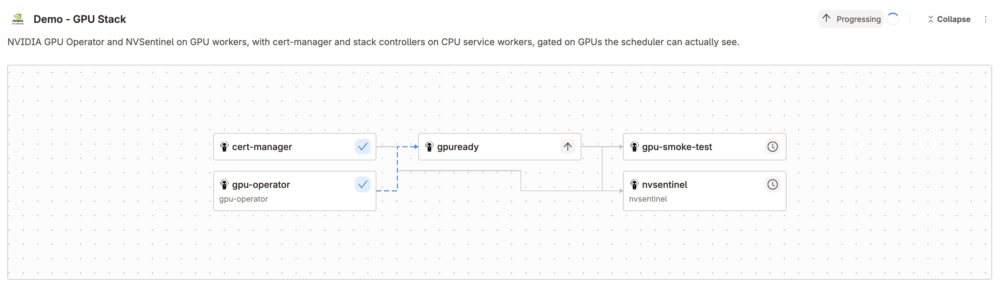

# NVIDIA GPU Operator Community Stack

This Stack turns a tenant cluster with private GPU nodes into a working NVIDIA GPU cluster. It
installs these components in dependency order:

- The [NVIDIA GPU Operator](https://docs.nvidia.com/datacenter/cloud-native/gpu-operator/latest/),
  through Argo CD.
- [NVSentinel](https://github.com/NVIDIA/NVSentinel) in dry-run monitoring mode, through Argo CD.
- Two readiness gates and a CUDA smoke test, as vCluster Platform Apps.

The gates hold the downstream tasks until the scheduler advertises GPUs and the DCGM host engine
is serving. The Stack reports healthy only after a CUDA workload has run on a GPU worker.

Everything the Stack deploys is in this directory or comes from a public upstream chart. The gate
Jobs run the vCluster Platform image the Platform already uses, so the Stack has no image or chart
of its own to build or publish.

The files in this directory are the source manifests, an example and the checks for the
`nvidia-gpu-operator` StackTemplate.

> [!IMPORTANT]
> This Stack is not marked `vcluster.com/certified`, and vCluster Platform does not bundle it.

## Contents

- [Architecture](#architecture)
- [Requirements](#requirements)
- [Files](#files)
- [Configure parameters](#configure-parameters)
- [Install](#install)
- [Verify](#verify)
- [Upgrade](#upgrade)
- [Remove](#remove)
- [Known limitations](#known-limitations)
- [Troubleshooting](#troubleshooting)
- [Test changes](#test-changes)

## Architecture

```text
gpu-operator (01) ---> gpuready (02) --+--> dcgmready (02) ---+
                                       |                       +--> nvsentinel (03)
                                       +-----------------------+
                                       |
                                       +--> gpu-smoke-test (03)
```

| Task | Type | Template | `dependsOn` | Timeout | Function |
| --- | --- | --- | --- | --- | --- |
| `gpu-operator` | `argoCDApplication` | `nvidia-gpu-operator-gpu-operator` | none | `45m0s` | Installs the GPU Operator. Controllers run on the CPU pool and node agents on the GPU pool. |
| `gpuready` | `app` | `nvidia-gpu-operator-gate` | `gpu-operator` | `28m0s` | Gate. Waits until the scheduler advertises `minGPUs`, then marks ConfigMap `gpu-stack-contract` ready. |
| `dcgmready` | `app` | `nvidia-gpu-operator-gate` | `gpuready` | `15m0s` | Gate. Waits for the `nvidia-dcgm` DaemonSet to finish rolling out on every GPU node. Publishes nothing. |
| `gpu-smoke-test` | `app` | `nvidia-gpu-operator-gpu-smoke-test` | `gpuready` | `12m0s` | Runs NVIDIA's CUDA VectorAdd sample on the GPU pool. |
| `nvsentinel` | `argoCDApplication` | `nvidia-gpu-operator-nvsentinel` | `gpuready`, `dcgmready` | `20m0s` | Installs NVSentinel in dry-run mode. Reads its DCGM address from the gate's contract. |

The Stack mixes two task types. **The workloads are Argo CD Applications**: once the Stack has
ordered the rollout, Argo CD owns their reconciliation and drift correction. **The gates and the
smoke test are Platform Apps**: their manifests, a Job with its RBAC, live inline in `apps/`.

An `argoCDApplication` task is ready when its Application reports both `Synced` and `Healthy`. An
`app` task is ready when the Platform's Helm deploy finishes. The Apps set `wait: true`, so Helm
waits for the Job to complete. A task that declares outputs is ready only after it has captured
them.

The timeouts use the full Go duration form, with seconds. `timeout` is a `metav1.Duration`, so
the API server stores `45m` as `45m0s`. If Argo CD manages the StackTemplate, that difference is
permanent drift.

### The gpuready gate

The GPU Operator Application goes `Healthy` as soon as Argo CD has created its resources. That
can be minutes to an hour before a driver is built, the device plugin has registered and the
scheduler admits a pod that requests `nvidia.com/gpu`.

A custom Argo CD health check cannot close that gap. It is a function of one resource the
Application manages, so it cannot sum allocatable GPUs across nodes or publish what it learned.
Health checks also live in `argocd-cm` or in Argo CD itself, so they cannot travel inside a
Stack.

The gate is a Job instead. `gpuready` deploys the gate App, whose Job counts allocatable
`nvidia.com/gpu` on nodes labeled `workload.example.com/pool=gpu-compute`. When the count
reaches `minGPUs`, the Job patches `ready`, `observedCount`, `resourceName` and `verifiedAt`
into the `gpu-stack-contract` ConfigMap in the `gpu-stack` namespace. Helm waits for the Job, so
the task stays `Progressing` until then.



*GPU Operator reports healthy, but `gpuready` holds, so the downstream tasks wait with it. The
screenshot is from an earlier version of this Stack that also installed cert-manager.*

`gpuready` declares Stack outputs read from the contract. Downstream tasks consume them instead
of hard-coding values:

```yaml
# nvsentinel
dcgmHost: '{{ .Outputs.gpuready.dcgmhost }}'
# gpu-smoke-test
gpuNodeSelector: 'workload.example.com/pool={{ .Outputs.gpuready.gpupool }}'
```

The StackTemplate also publishes `gpucount`, `gpupool`, `dcgmhost` and `dcgmport` as Stack
outputs.

By default the gate does not wait on `ClusterPolicy`. `ClusterPolicy` aggregates every GPU
Operator operand, so it stays `notReady` while `dcgm-exporter` loses a startup race that nothing
downstream depends on. In a measured run that cost about 90 seconds. Set `waitForClusterPolicy`
to `true` to hold for the whole operand set.

### The dcgmready gate

The GPU Operator creates `dcgm-exporter` and `nvidia-dcgm` at the same time, with nothing
ordering them. Without this gate, NVSentinel can start before the DCGM host engine is serving
and report `GpuDcgmConnectivityFailure`.

`dcgmready` runs the same gate App with different parameters: `kubectl rollout status` on
`daemonset/nvidia-dcgm`, which covers any number of GPU workers. It depends on `gpuready`
because a DaemonSet that schedules no pods yet has already finished rolling out. Waiting for a
GPU node first makes the rollout wait meaningful.

### The gate App

[apps/02-gate.yaml](apps/02-gate.yaml) is workload-agnostic. Its parameters choose what to wait
for (`waitResource`, `waitCondition`, or `rollout`), what capacity to count (`capacityResource`,
`capacityMin`, `capacityNodeSelector`) and what contract to publish (`contractName`,
`contractData`). The GPU-specific keys are in the StackTemplate, with the tasks that use them.

The Job runs `.Values.__image__`, which the Platform sets to its own image when an App's
manifests reference it. That image has `sh` and `kubectl`, which is all the gate script needs.
It also matches the installed Platform version, so there is no image to build, publish or pin.

App tasks behave differently from Argo CD tasks in two ways:

- **No parameter defaults.** A Stack task's AppInstance does not apply App parameter defaults.
  The tasks pass every value the gate relies on, and the manifests guard each one with
  `default`. Booleans arrive as the strings `"true"` and `"false"`.
- **A 30 minute cap.** The Platform stops any App deploy after 30 minutes. The gate App's
  `timeout` is `25m`, `gpuready` gives its Job a 1380 second deadline, and the task timeout of
  `28m0s` sits above both. The Job deadline fires first, so a stuck gate fails with a reason in
  its log.

### Node placement

Two NodeProfiles in [nodeprofiles.yaml](nodeprofiles.yaml) define what the tenant cluster
scheduler sees:

| NodeProfile | Node label | Taints |
| --- | --- | --- |
| `nvidia-gpu-operator-cpu-services` | `workload.example.com/pool=cpu-services` | none |
| `nvidia-gpu-operator-gpu-compute` | `workload.example.com/pool=gpu-compute` | `nvidia.com/gpu=true:NoSchedule` |

Pods reach a pool through a `nodeSelector` on `workload.example.com/pool`. Pods that select
`gpu-compute` also tolerate the GPU taint.

| Components | Placement |
| --- | --- |
| GPU Operator controller, NFD master and garbage collector | CPU pool |
| NFD workers | GPU pool, with the GPU taint toleration |
| NVIDIA driver, toolkit, device plugin, validators, DCGM | Operator-managed GPU selectors, with the GPU taint toleration |
| Gate Jobs | CPU pool. The gate only talks to the API server. |
| CUDA smoke test | GPU pool, with the GPU taint toleration and a GPU request |
| NVSentinel labeler | CPU pool |
| NVSentinel health monitors, metadata collector, `platformConnector` | GPU pool, with the GPU taint toleration |

The CPU pool label value is the `cpuNodePool` parameter. The GPU pool value `gpu-compute` is
fixed in the templates.

The profiles do not use `startupTaints`. Those are removed when the node becomes Ready, which
does not prove that NVIDIA initialization has completed. The `gpuready` gate handles GPU
readiness at the Stack level.

## Requirements

- vCluster Platform 4.12 or later. The Stack uses only APIs available in 4.12.
- vCluster 0.37 or later in the tenant cluster for `deploy.stacks`. The tenant cluster template
  pins `0.37.2`.
- An Argo CD connector in the Platform. You also need an Argo CD project that permits the GPU
  Operator and NVSentinel chart sources and the destination namespaces `gpu-operator` and
  `nvsentinel`.
- A node provider with at least one NVIDIA GPU machine, and a provider with a CPU machine. One
  provider can serve both.
- Platform Private Nodes, with the VPN reachable by the workers. The control plane cluster needs
  storage for the tenant control plane PVC. The tenant cluster template enables Flannel.
- Compatible GPU hardware, node OS and kernel. Either a node image with the NVIDIA driver
  preinstalled (`driverPreinstalled: true`, recommended), or network access for the GPU Operator
  to pull and build the driver.
- Network access from Argo CD and from the workers to these sources:

  | Source | Used by |
  | --- | --- |
  | `https://helm.ngc.nvidia.com/nvidia`, `nvcr.io` | GPU Operator chart and images, CUDA sample |
  | `oci://ghcr.io/nvidia/nvsentinel`, `ghcr.io/nvidia` | NVSentinel chart and images |
  | The vCluster Platform image, `ghcr.io/loft-sh/vcluster-platform` or your mirror | Gate Jobs, on the CPU pool |

### cert-manager for production NVSentinel

cert-manager is not part of this Stack, and the Stack does not need it. NVSentinel runs here in
dry-run mode, and that configuration renders no cert-manager resources.

A production NVSentinel does need it. MongoDB store, which quarantine, draining and remediation
depend on, needs cert-manager for its certificates. So do Janitor, janitor-provider, preflight
and PostgreSQL. Install cert-manager in the tenant cluster before you enable any of them, and
add the dependency to your Stack if you manage cert-manager there.

## Files

| File | Purpose |
| --- | --- |
| [stacktemplate.yaml](stacktemplate.yaml) | StackTemplate `nvidia-gpu-operator`: five tasks, parameters and published outputs |
| [apps/01-gpu-operator.yaml](apps/01-gpu-operator.yaml) | ArgoCDApplicationTemplate `nvidia-gpu-operator-gpu-operator` |
| [apps/02-gate.yaml](apps/02-gate.yaml) | App `nvidia-gpu-operator-gate`, the reusable readiness gate |
| [apps/03-gpu-smoke-test.yaml](apps/03-gpu-smoke-test.yaml) | App `nvidia-gpu-operator-gpu-smoke-test` |
| [apps/03-nvsentinel.yaml](apps/03-nvsentinel.yaml) | ArgoCDApplicationTemplate `nvidia-gpu-operator-nvsentinel` |
| [nodeprofiles.yaml](nodeprofiles.yaml) | NodeProfiles for the CPU services pool and the GPU pool |
| [virtualclustertemplate.yaml](virtualclustertemplate.yaml) | VirtualClusterTemplate `nvidia-gpu-operator-private-nodes`: both pools, the Argo CD integration and the Stack through `deploy.stacks` |
| [example/stackinstance.yaml](example/stackinstance.yaml) | StackInstance for an existing tenant cluster |
| [test-manifests.sh](test-manifests.sh) | Static and render checks |

The `apps/` file numbers are a topological order of the task graph. Every object carries the
label `app.kubernetes.io/part-of: nvidia-gpu-operator-stack`.

## Configure parameters

Set these on the tenant cluster template when you create a tenant cluster. The template passes
the Stack parameters through `deploy.stacks`.

| Parameter | Default | Purpose |
| --- | --- | --- |
| `kubernetesVersion` | `v1.36.4` | Tenant cluster control plane version |
| `argoConnector` | required | Existing Platform Argo CD connector |
| `argoProject` | `default` | Argo CD project for the GPU Operator and NVSentinel Applications |
| `gpuNodeProvider` | required | Node provider for the GPU pool |
| `gpuNodeType` | `xlarge-gpu` | The provider's `vcluster.com/profile` node type for GPU machines |
| `gpuNodeCount` | `1` | GPU workers to provision |
| `cpuNodeProvider` | required | Node provider for the CPU services worker. Can equal `gpuNodeProvider`. |
| `cpuNodeType` | `large` | The provider's `vcluster.com/profile` node type for the CPU worker |
| `cpuNodePool` | `cpu-services` | Value of `workload.example.com/pool` on CPU workers |
| `minGPUs` | `1` | GPUs the scheduler must advertise before `gpuready` passes |
| `driverPreinstalled` | `false` | `true` when the node image has the NVIDIA driver. GPU Operator skips the driver, and NVSentinel labels in preinstalled-driver mode. |
| `waitForClusterPolicy` | `false` | `true` also waits for every GPU Operator operand |
| `gpuOperatorVersion` | `v26.3.3` | GPU Operator chart version |
| `nvsentinelVersion` | `v1.13.0` | NVSentinel chart and image version |

The StackTemplate declares the Stack parameters: `argoProject`, `cpuNodePool`, `minGPUs`,
`driverPreinstalled`, `waitForClusterPolicy`, `gpuOperatorVersion` and `nvsentinelVersion`. The
others shape the tenant cluster.

Notes:

- **Size the CPU pool for about a dozen pods.** That covers the GPU Operator controller, NFD
  master and garbage collector, the NVSentinel labeler, the gate Jobs and the system pods. On a
  2 cpu / 4Gi node with cert-manager also running, the GPU Operator controller lost its leader
  election lease during image extraction and restarted three times. 4 cpu / 8Gi had enough
  headroom.
- **`vcluster.com/profile` is unrelated to NodeProfiles.** In `nodeTypeSelector` it names a node
  type published by the provider. The pool's `profile` field names the NodeProfile.
- **Both pools are required.** Without a CPU worker labeled with `cpuNodePool`, the GPU
  Operator controller and the gate Jobs stay Pending.
- **`cpuNodePool` does not rename the NodeProfile.** If you change it, change the label in
  `nvidia-gpu-operator-cpu-services` to match.
- **Ownership.** The templates are owned by the `loft-admins` team. Change `spec.owner` if your
  installation uses another team. The Platform project must allow the tenant cluster template,
  the node providers and both NodeProfiles.

## Install

All commands below go to the Platform **management API**, not to a cluster. Get a kubeconfig
with `vcluster platform connect management`.

```bash
# 1. NodeProfiles, the ArgoCDApplicationTemplates, the Apps and the StackTemplate.
kubectl apply -f community-stacks/nvidia-gpu-operator/nodeprofiles.yaml \
  -f community-stacks/nvidia-gpu-operator/apps/ \
  -f community-stacks/nvidia-gpu-operator/stacktemplate.yaml
# 2. The tenant cluster template that provisions both pools and installs the Stack.
kubectl apply -f community-stacks/nvidia-gpu-operator/virtualclustertemplate.yaml
```

Then create a tenant cluster from **NVIDIA GPU Stack - Private Nodes** under **Tenant Clusters >
New Tenant Cluster**, and set the [parameters](#configure-parameters).

To install the Stack into an existing tenant cluster instead, the tenant cluster needs the Argo
CD integration and nodes labeled and tainted as the NodeProfiles describe. Set
`destination.virtualCluster.name` in the example first, then apply it in the project namespace:

```bash
kubectl apply -n p-default -f community-stacks/nvidia-gpu-operator/example/stackinstance.yaml
```

UI: **tenant cluster > Stacks > Install Stack > "NVIDIA GPU Operator and NVSentinel"**.

## Verify

Find the StackInstance and follow its tasks on the management API:

```bash
kubectl get stackinstances -A
kubectl -n <project-namespace> get stackinstance <name> \
  -o jsonpath='{.status.phase}{"\n"}{range .status.tasks[*]}{.name}{"\t"}{.phase}{"\t"}{.message}{"\n"}{end}'
```

The phase moves through `Pending` and `Progressing` to `Healthy`, or `Degraded` when a task
fails or times out. `gpuready` stays `Progressing` while the driver is built and the device
plugin registers.

With the tenant cluster kubeconfig, watch the gate and read the contract:

```bash
kubectl -n gpu-stack logs -f -l app.kubernetes.io/component=gpuready --tail=-1
kubectl -n gpu-stack get configmap gpu-stack-contract -o yaml
```

The smoke test proves that the GPU computes. Expect `Test PASSED`:

```bash
kubectl -n gpu-stack logs -l app.kubernetes.io/name=nvidia-gpu-operator-gpu-smoke-test --tail=-1
```

Check placement and the GPUs the scheduler advertises:

```bash
kubectl get nodes -L workload.example.com/pool
kubectl get pods -n gpu-operator -o wide
kubectl get pods -n gpu-stack -o wide
kubectl get pods -n nvsentinel -o wide
kubectl get nodes -o json | jq '.items[] | {name: .metadata.name, pool: .metadata.labels["workload.example.com/pool"], gpus: (.status.allocatable["nvidia.com/gpu"] // "0")}'
```

To run your own GPU workload, select the pool, tolerate the taint and request a GPU:

```yaml
nodeSelector:
  workload.example.com/pool: gpu-compute
tolerations:
  - key: nvidia.com/gpu
    operator: Equal
    value: "true"
    effect: NoSchedule
resources:
  limits:
    nvidia.com/gpu: 1
```

## Upgrade

- **Chart versions.** Change `gpuOperatorVersion` or `nvsentinelVersion`. Argo CD upgrades the
  release in place. Renovate tracks the defaults in this directory.
- **Gate image.** The gate Jobs follow the Platform image. A Platform upgrade changes it, with
  nothing to do here.
- **Template parameters on existing tenant clusters.** A `VirtualClusterInstance` keeps the
  parameter values rendered at creation. A new or changed template parameter reaches existing
  tenant clusters only after **Sync Template** on the instance, or `spec.templateRef.syncOnce:
  true`. Until then, a new parameter renders as an empty string, with no error.
- **Re-running a gate.** The gate Job name carries a hash of its settings. A Job spec is
  immutable, so a changed setting creates a new Job, which runs the gate again.

## Remove

```bash
kubectl -n <project-namespace> delete stackinstance <name>
```

The Platform deletes each child Argo CD Application with cascade, so Argo CD prunes the GPU
Operator and NVSentinel resources. It deletes the gate and smoke test AppInstances, which
uninstalls their Helm releases. These remain:

- The namespaces `gpu-operator` and `nvsentinel`, which Argo CD creates through
  `CreateNamespace=true`, and `gpu-stack`.
- Node labels that NFD and GPU Feature Discovery wrote. `node-feature-discovery.postDeleteCleanup`
  is `false`.
- A preinstalled NVIDIA driver in the node image.

Removal has not been exercised end to end for this Stack.

A tenant cluster created from **NVIDIA GPU Stack - Private Nodes** gets its StackInstance from
`deploy.stacks`, and the cluster itself does not carry this Stack's label. Delete the tenant
cluster instead, which removes its Stack and releases its nodes back to the node provider.

When no instance or tenant cluster references them, remove the templates and profiles from the
Platform:

```bash
kubectl delete apps,argocdapplicationtemplates,stacktemplates,virtualclustertemplates,nodeprofiles \
  -l app.kubernetes.io/part-of=nvidia-gpu-operator-stack
```

## Known limitations

- NVSentinel runs in dry-run mode. Quarantine, draining, remediation, Janitor and MongoDB are
  disabled, so the Stack does not demonstrate automatic fault recovery. Enabling them requires
  cert-manager; see [cert-manager for production NVSentinel](#cert-manager-for-production-nvsentinel).
  Prometheus PodMonitor and ServiceMonitor creation is disabled.
- The `gpuready` gate has a 1380 second budget, because Platform App deploys stop at 30 minutes.
  The slowest measured run, with an in-cluster driver build, passed the gate 9m21s after the GPU
  node joined. A driver build slower than about 23 minutes fails the gate.
- The gates are one-shot. If the GPU degrades later, the gate does not notice. Ongoing health is
  a monitoring concern.
- The GPU pool label value `gpu-compute` and the contract namespace `gpu-stack` are fixed in the
  templates.
- The GPU Operator CRD upgrade hook has no node selector in the pinned chart. It does not
  tolerate the GPU taint, so the taint keeps it off GPU workers.
- The smoke test occupies one GPU for the few seconds it runs.

## Troubleshooting

- **GPU Operator controller or a gate Job Pending.** No CPU worker has the `cpuNodePool` label.
  These pods cannot use the GPU pool.
- **A task stays Pending.** It waits on its `dependsOn` list. A `Degraded` task names its reason
  in `message`. Also check the tenant cluster's `StacksSynced` condition, the Argo CD
  Applications and the AppInstances in the project namespace.
- **`gpuready` stuck Progressing or failed.** Read the gate log,
  `kubectl -n gpu-stack logs -l app.kubernetes.io/component=gpuready --tail=-1`. It names the step
  it is on and the allocatable count. A low count means no GPU is allocatable yet. Check the
  device plugin pods and `kubectl get nodes -o json | jq '.items[].status.allocatable'`.
- **Gate Job in `ImagePullBackOff`.** The CPU workers cannot pull the Platform image. In an
  air-gapped installation, the Platform's image mirror must be reachable from tenant cluster
  workers as well.
- **NVSentinel reports `GpuDcgmConnectivityFailure`.** NVSentinel started before DCGM was
  serving. Confirm that `dcgmready` ran and passed.
- **`gpu-smoke-test` Pending.** The gate passed, so a GPU was allocatable, but another pod now
  holds it.
- **`gpu-smoke-test` failing.** Read its log. A pull failure points at `nvcr.io` access. A CUDA
  error points at the driver or toolkit.
- **`gpuready` healthy but `nvsentinel` still waiting.** A task that declares outputs is not
  ready until it captures them, reported as `CapturingOutputs`. Confirm that `gpu-stack-contract`
  exists and holds the keys the outputs read.
- **Chart or image download failures.** Check registry and repository access from Argo CD and
  the workers. Local rendering does not prove that the deployed cluster can pull artifacts.

## Test changes

From the repository root, run the static checks (bash 4 or later, python3 with PyYAML and helm):

```bash
./community-stacks/nvidia-gpu-operator/test-manifests.sh
```

The checks render the graph for the default parameters and for a variant that takes the other
branch of every conditional. They render StackTemplate tasks and ArgoCDApplicationTemplates with
Helm's template engine. They render each App's manifests as the chart the Platform builds, with
only the parameters the task passes. They assert:

- Names carry the `nvidia-gpu-operator` prefix and the `part-of` label, and match their files.
- Every `.Values` reference is a declared parameter. Every task passes only parameters that its
  template declares, and each task type matches its template's kind. The tenant cluster
  template passes every Stack parameter.
- Timeouts are in canonical Go duration form. App timeouts stay under the 30 minute cap, and
  each task timeout exceeds the App or Job deadline it waits on.
- Tasks with outputs have no hyphen, and the graph is acyclic. Every `.Outputs` reference reads
  a declared output of a dependency, from a key the contract holds, in the namespace the gate
  deploys to. `dcgmready` follows `gpuready`.
- The gate runs the Platform image on the CPU pool, and each App renders exactly one Job.
- The parameters do what they promise. `driverPreinstalled` reaches GPU Operator and NVSentinel,
  `waitForClusterPolicy` switches the gate's wait, and `minGPUs` sets the capacity it counts.
- No NVSentinel component that needs cert-manager is enabled.
- The tenant cluster template renders one `autoNodes` entry per provider, every pool references
  a NodeProfile defined here, and `gpuNodeCount` sets the GPU pool size.

CI also runs a server-side dry run of every manifest against vCluster Platform.

### Tested

An earlier version of this Stack ran end to end on bare metal on 2026-09-23. That version used
Argo CD for every task, ran its gates from a separately built image and also installed
cert-manager. Both gates passed, the CUDA sample reported `Test PASSED`, and NVSentinel started
behind `dcgmready`. The GPU node joined at 19:39:10 and `gpuready` passed at 19:44:50, with the
driver preinstalled in the node image.

This version has not run on a live cluster. In particular, these have not been exercised:

- The App-based gates and smoke test.
- The NVSentinel task without cert-manager.
- The provider parameters in the tenant cluster template.
- `waitForClusterPolicy: true` and more than one GPU worker.
- Removal.

## License

This Stack is part of this repository and is licensed under the
[Apache License 2.0](../../LICENSE).
